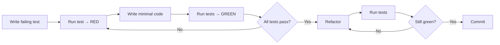
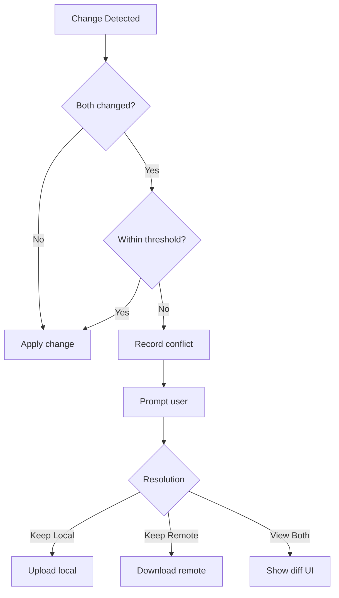
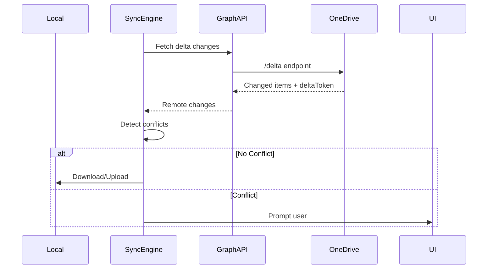

# Copilot Instructions - AStar Dev OneDrive Sync Client

## Project Overview

**AStar Dev OneDrive Sync Client** is a cross-platform desktop application that provides bidirectional synchronization between local file systems and Microsoft OneDrive. Built with Avalonia (cross-platform UI framework) and .NET 10, it features intelligent conflict detection, multi-account support, and efficient delta-based synchronization.

### Key Characteristics

- **Language**: C# 14
- **Target Framework**: .NET 10.0
- **UI Framework**: Avalonia 11.3.11 with ReactiveUI
- **Database**: SQLite with Entity Framework Core 10.0.2
- **Authentication**: MSAL (Microsoft.Identity.Client 4.81.0)
- **API Integration**: Microsoft Graph API 5.101.0
- **Async Patterns**: System.Reactive 6.1.0
- **Testing**: xUnit with in-memory databases and mocking

---

## Architecture Overview

### Layered Architecture

#### 1. **Presentation Layer** (`AStar.Dev.OneDrive.Sync.Client`)

- Avalonia UI with XAML views and ViewModels
- ReactiveUI for MVVM implementation
- View-specific converters and behaviors

#### 2. **Infrastructure Layer** (`AStar.Dev.OneDrive.Sync.Client.Infrastructure`)

**Key Services**:

- `AutoSyncSchedulerService` - Scheduled sync execution
- `AuthenticationClient` - OAuth/MSAL wrapper
- `DebugLoggerService` - Application-wide logging
- `WindowPreferencesService` - UI state persistence

**Key Repositories** (using Repository pattern):

- `IAccountRepository` - Account metadata and authentication tokens
- `ISyncRepository` - Sync state and session tracking
- `IDriveItemsRepository` - Remote file metadata caching
- `ISyncConfigurationRepository` - User sync folder selections
- `ISyncConflictRepository` - Conflict records and resolutions
- `IFileOperationLogRepository` - Historical file operations
- `IDebugLogRepository` - Application logs

#### 3. **Core/Domain Layer** (`AStar.Dev.OneDrive.Sync.Client.Core`)

- **Models**: Domain objects and data structures
- **Data Entities**: EF Core entity definitions
- **Enums**: Sync state and configuration enums

**Key Models**:

- `AccountInfo` - User account and authentication state
- `FileMetadata` - File properties and sync status
- `SyncConfiguration` - User-defined sync selections
- `SyncState` - Current synchronization status
- `SyncConflict` - Conflict information and resolution
- `SyncSessionLog` - Sync operation history
- `WindowPreferences` - UI preferences persistence

### Dependency Injection

The solution uses **Microsoft.Extensions.DependencyInjection** with custom source generators:

- **Service Decorator**: `[Service]` attribute (custom)
- **Lifetime Options**: Scoped (default), Singleton, Transient
- **Generator**: `AStar.Dev.Source.Generators` auto-generates `ServiceCollectionExtensions`
- **Configuration**: Services are automatically registered based on attributes
- **Access**: Services accessed via `App.Host.Services` (ServiceLocator pattern)

```csharp
[Service(ServiceLifetime.Scoped, As = typeof(IMyInterface))]
public class MyImplementation : IMyInterface { }
```

### Supporting NuGet Packages

Custom internal packages (located in `src/nuget-packages/`):

- **AStar.Dev.Functional.Extensions** - Result<T>, Option<T>, functional programming utilities
- **AStar.Dev.Logging.Extensions** - Structured logging helpers
- **AStar.Dev.Source.Generators** - Service registration and options binding code generation
- **AStar.Dev.Utilities** - Common utilities (JSON, regex, string extensions)

---

## Development Approach & Patterns

**Test-Driven Development (TDD) Policy**

<CRITICAL_REQUIREMENT type="MANDATORY">
All changes must follow Red → Green → Refactor cycle. Failing tests must be committed to the branch history to demonstrate TDD progression. If a failing test is not present, reviewers should request clarification. Tests should be small, focused, and behavior-driven. Use mocks and test doubles for external dependencies. Integration tests should be used for cross-service flows, and E2E tests should be reserved for critical user-facing scenarios.
</CRITICAL_REQUIREMENT>



- **Mocks & Test Doubles**: Use interface-based abstractions (existing repository and service interfaces) with in-memory or mocked implementations for unit tests. For EF Core, prefer in-memory providers or explicit SQLite in-memory modes where appropriate.
- **Commit Practice**: Each feature branch should include the failing-test commit (the test authoring step) in the branch history so reviewers can verify the TDD progression. If the failing test is not present, reviewers should request clarification.

<a name="quality-policy"></a>

## Quality & Coverage Policy

### Code Coverage Requirements

- **Minimum**: 80% branch coverage for new code
- **Critical paths**: 100% coverage (authentication, sync engine, conflict resolution)
- **Hot paths**: 100% coverage with error path testing
- **Test pyramid guidelines**: 70% unit, 20% integration, 10% E2E

### Branching Strategy

- **Main**: Protected, deployable, always green
- **Feature branches**: `feature/`, `fix/`, `refactor/`, `docs/`
- **Merge**: Squash and merge
- **Naming**: `<type>/<brief-description>` (e.g., `feature/add-conflict-ui`)

### Branch Protection Rules

- Require PR approval
- Require CI tests pass
- Require up-to-date with main
- No force push to main

**Pull Request (PR) Policy**

- **Mandate**: PR size should be manageable for code review (ideally < 300 lines of code changed / < 20 files). If a feature requires a large number of changes, consider breaking it down into smaller, incremental PRs that can be reviewed and merged independently. Each PR should represent a cohesive unit of work that can be understood and reviewed in isolation.
- **Mandate**: For development tasks that require larger changes (e.g., architectural refactors, multi-feature work), the work should be protected behind a feature flag that is disabled by default. This allows the code to be merged into main without impacting existing functionality, while still enabling incremental development and testing of the new code paths. The feature flag should be removed once the work is complete and stable. If the new feature / code changes replace existing functionality, the old code should be left in place and protected behind a feature flag until the new code is fully implemented and tested, at which point the old code can be removed in a subsequent PR. This approach allows for safer refactoring and reduces the risk of breaking existing functionality while still enabling progress on new features.
- **Mandate**: All PRs must include a descriptive title and a detailed description of the changes made, the rationale behind them, and any relevant context for reviewers. The description should also include information about testing performed (unit tests, integration tests, manual testing) and any areas that require special attention during review. If the PR addresses a specific issue or feature request, it should reference the corresponding issue number in the description.
- **Mandate**: All PRs must pass automated checks (build, tests, linting) before they can be merged. If any checks fail, the author must address the issues and ensure all checks pass before the PR can be approved and merged.
- **Mandate**: All PRs must be reviewed and approved by at least one other team member before they can be merged. Reviewers should provide constructive feedback and request changes if necessary to ensure code quality and maintainability. The author should respond to feedback in a timely manner and make necessary changes to address reviewer comments.
- **Mandate**: All PRs must be merged using the "Squash and Merge" strategy to maintain a clean commit history. The commit message for the merged PR should follow conventional commit format (e.g., `feat: add new feature`, `fix: resolve bug`, `refactor: improve code structure`) to provide clear context in the commit history.
- **Mandate**: Whenever possible, PRs should be reviewed and merged within 24 hours of creation to maintain development momentum and ensure timely feedback. If a PR requires more time for review or additional context, the author should communicate this in the PR description or comments to set expectations for reviewers. Likewise, reviewers should strive to provide feedback within 12 hours of being assigned to a PR to keep the development process efficient and responsive.
- **CI gates**: All tests pass, no warnings, linter clean

**Branching Strategy**

- **Mandate**: The repository should follow a trunk-based development strategy, where all development work is done on short-lived feature branches that are merged back to the main branch frequently (ideally within a day or two). Long-lived branches that diverge significantly from main should be avoided to prevent merge conflicts and ensure continuous integration. Each feature branch should be created from the latest main branch to minimize divergence and reduce the likelihood of conflicts during merging.
- **Mandate**: All new features, bug fixes etc., must be created on a feature branch and follow TDD practices. Unless explicitly stated, the development workflow should use trunk-based development with short-lived feature branches that are merged back to main frequently (ideally within a day or two). Long-lived branches that diverge significantly from main should be avoided to prevent merge conflicts and ensure continuous integration. Each feature branch should be created from the latest main branch to minimize divergence and reduce the likelihood of conflicts during merging.
- **Mandate**: The main branch should always be in a deployable state, with all tests passing and no known critical bugs. Feature branches should be tested and reviewed thoroughly before being merged to main to maintain this standard. If a feature branch introduces breaking changes or significant new functionality, it should be protected behind a feature flag until it is fully implemented and tested, allowing it to be merged into main without impacting existing functionality.
- **Mandate**: The naming convention for feature branches should be `feature/<descriptive-name>` (e.g., `feature/add-file-watcher-service`, `feature/implement-sync-algorithm`). This naming convention provides clear context about the purpose of the branch and helps maintain an organized repository structure. For bug fixes, the convention should be `fix/<descriptive-name>` (e.g., `fix/resolve-sync-conflict`, `fix/handle-authentication-error`). For refactors, the convention should be `refactor/<descriptive-name>` (e.g., `refactor/extract-repository-interfaces`, `refactor/improve-error-handling`). This consistent naming strategy helps developers quickly understand the intent of each branch and facilitates easier navigation and management of branches in the repository.

### 1. Dependency Injection & Testability

**Core Principle**: All external dependencies are abstracted behind interfaces.
**Pattern**:

- Create interface in `Infrastructure/Services/I<ServiceName>.cs`
- Implement in `Infrastructure/Services/<ServiceName>.cs`
- Decorate with `[Service]` attribute
- Inject via constructor
- Mock in tests via interface

**Example**:

```csharp
// Infrastructure/Services/IGraphApiClient.cs
public interface IGraphApiClient
{
    Task<DriveItem> GetItemAsync(string accountId, string itemId);
}

// Infrastructure/Services/GraphApiClient.cs
[Service]
public class GraphApiClient : IGraphApiClient
{
    public async Task<DriveItem> GetItemAsync(string accountId, string itemId) { }
}
```

### 2. Repository Pattern

Data access is abstracted through repositories:

- **Location**: `Infrastructure/Repositories/`
- **Pattern**: All data operations go through repository interfaces
- **Database Access**: EF Core DbContext via `SyncDbContext`
- **Migrations**: Located in `Infrastructure/Data/Migrations/`

**Repository Principles**:

- One repository per aggregate/entity type
- Methods return domain models, not entities
- DbContext is scoped to service lifetime
- Queries include necessary `Include()` statements for relationships

### 3. Reactive Programming

The application uses **System.Reactive** for asynchronous operations:

**Patterns**:

- `IObservable<T>` for observable sequences
- `BehaviorSubject<T>` for mutable observable state
- ReactiveUI: `ReactiveObject` and `WhenAnyValue()` for ViewModel binding
- `CancellationToken` for cancellation support

**Example**:

```csharp
private readonly BehaviorSubject<SyncState> _progressSubject;

public IObservable<SyncState> Progress => _progressSubject;

_progressSubject.OnNext(newState); // Emit state change
```

### 4. Conflict Detection & Resolution

**Strategy**: Last-Write-Wins based on timestamps

- Remote changes tracked via `cTag` (Microsoft's content tag)
- Local changes tracked via file modification time (`mtime`)
- Allowed time difference threshold: 60 seconds

**Conflict Flow**:

1. Remote change fetched via Graph API
2. Compare with local file timestamp
3. If both changed recently: Record conflict
4. User resolves via UI: Keep local, keep remote, or view both
5. Resolution applied and sync continues



### 5. Sync Algorithm

**Two-Phase Sync Process**:

1. **Download Phase (Remote → Local)**
   - Fetch delta changes using Microsoft Graph delta query
   - Process each remote change
   - Detect conflicts with local changes
   - Apply non-conflicting downloads
   - Save progress (delta token for resumption)

2. **Upload Phase (Local → OneDrive)**
   - Query pending uploads from database
   - Process each local change
   - Upload to OneDrive via Graph API
   - Update local metadata with remote cTag
   - Mark as synced



**For Details**: See `docs/sync-algorithm-overview.md`

### 6. Testing Strategy

See **Test-Driven Development (TDD) Policy** section above for complete testing patterns and practices.

### 7. Database & EF Core

**DbContext**: `SyncDbContext` (in `Infrastructure/Data/`)

**Configuration**:

- Uses SQLite for local storage
- Located in platform-specific data directories:
  - **Windows**: `%APPDATA%/astar-dev-onedrive-sync-client/`
  - **Linux**: `~/.local/share/astar-dev-onedrive-sync-client/`
  - **macOS**: `~/Library/Application Support/astar-dev-onedrive-sync-client/`
- Migrations tracked in `Infrastructure/Data/Migrations/`

**Creating Migrations**:

```bash
dotnet ef migrations add MigrationName --project src/AStar.Dev.OneDrive.Sync.Client.Infrastructure
```

**Key Entities**:

- Account authentication tokens and metadata
- Synced file metadata and state
- Sync configuration and selections
- Conflict records
- Operation history logs

### 8. Authentication (MSAL)

**Flow**:

1. User initiates login
2. `IAuthenticationClient` prompts OAuth flow
3. MSAL caches tokens securely
4. `IGraphApiClient` uses cached/refreshed tokens for API calls
5. Refresh token renewal: Automatic on expiration

**Multi-Account Support**:

- Each account stored separately in database
- Account ID (from Azure AD) is key identifier
- AuthenticationClient manages per-account token cache

### 9. Configuration & Logging

**Configuration Sources** (in order of precedence):

1. User Secrets (dev environment)
2. `appsettings.json`
3. Environment variables
4. Azure Key Vault (production)

**Logging**:

- **Framework**: Serilog with structured logging
- **Sinks**: Console, async file
- **Log Levels**: Trace → Verbose, Debug, Info, Warning, Error, Fatal
- **Context**: `DebugLogContext` adds account ID to all logs
- **Storage**: Debug logs stored in database and exported

### 10. Source Generators

**Purpose**: Reduce boilerplate and improve compile-time safety

**Generators Available**:

- **ServiceRegistration**: Auto-registers `[Service]` classes
- **OptionsBinding**: Auto-binds config sections to POCO classes

**Example**:

```csharp
[Service(ServiceLifetime.Singleton)]
public class MyService : IMyService { }
// Generates:
// services.AddSingleton<IMyService, MyService>();
```

### 11. Code Style & Quality

**Core Style Guidelines**: See [style-guidelines.instructions.md](./instructions/style-guidelines.instructions.md) for comprehensive coding standards including:

- Naming conventions (PascalCase, camelCase, etc.)
- Class and method design principles (SOLID, cohesion, coupling)
- Immutability and record design patterns
- Test class conventions and patterns
- General best practices

**Project-Specific Compiler Settings**:

- **Language Version**: C# 14 with nullable reference types enabled
- **Warnings as Errors**: `TreatWarningsAsErrors = true`
- **Implicit Usings**: Enabled
- **XML Documentation**: Required on public members; never comment private members or tests

**Modern C# Features** (Leverage C# 9-14 capabilities):

- Use `PrimaryConstructor` syntax when possible to reduce boilerplate
- Use `global using` directives for commonly used namespaces
- Use `file-scoped namespaces` for better readability and less indentation
- Use `top-level statements` for simple entry points (e.g., `Program.cs`)
- Use `target-typed new` expressions to reduce redundancy when the type can be inferred
- Use `record struct` for small, immutable value types that do not require reference semantics

**Asynchronous Programming**:

- Use `using` statements and leverage IDisposable/IAsyncDisposable
- Use async/await throughout; never do sync-over-async (e.g., `Task.Wait()`, `Task.Result`)
- Use `ConfigureAwait(false)` in library code to avoid deadlocks in UI contexts
- Use `async` suffix for asynchronous methods (e.g., `GetItemAsync()`)
- Use `CancellationToken` parameters for all async methods that support cancellation
- Use `IAsyncDisposable` and `await using` for async cleanup when necessary

**Functional Programming** (Project-Specific Utilities):

- Use `Result<T>` and `Option<T>` from `AStar.Dev.Functional.Extensions` package for error handling and optional values
- Use `Match`/`MatchAsync` methods on `Result<T>` and `Option<T>` for handling success and failure cases without exceptions
- Use `Map`/`MapAsync` and `Bind`/`BindAsync` methods for transforming and chaining operations on `Result<T>` and `Option<T>` types
- Prefer functional constructs over traditional exception-based error handling in business logic

---

## File Organization & Conventions

### Folder Structure

```
src/
├── AStar.Dev.OneDrive.Sync.Client/           # Presentation Layer
│   ├── Accounts/                        # Account management UI
│   ├── MainWindow/                      # Main window + ViewModel
│   ├── Syncronisation/                  # Sync UI components
│   ├── SyncronisationConflicts/         # Conflict resolution UI
│   ├── DebugLogs/                       # Debug logging viewer
│   ├── Converters/                      # Avalonia value converters
│   ├── Assets/                          # Images, icons, resources
│   ├── ConfigurationSettings/           # App configuration
│   ├── Program.cs                       # Entry point
│   └── App.axaml.cs                     # Application initialization
│
├── AStar.Dev.OneDrive.Sync.Client.Infrastructure/  # Infrastructure Layer
│   ├── Services/                        # Business logic services
│   │   ├── Authentication/              # Auth services
│   │   └── OneDriveServices/            # OneDrive-specific services
│   ├── Repositories/                    # Data access
│   ├── Data/                            # EF Core context + migrations
│   └── SerilogLogParser.cs              # Log parsing utilities
│
├── AStar.Dev.OneDrive.Sync.Client.Core/      # Core/Domain Layer
│   ├── Models/                          # Domain models
│   ├── Data/
│   │   └── Entities/                    # EF Core entities
│   ├── ApplicationMetadata.cs
│   └── DatabaseConfiguration.cs
│
└── nuget-packages/                      # Internal packages
    ├── AStar.Dev.Logging.Extensions/
    ├── AStar.Dev.Functional.Extensions/
    ├── AStar.Dev.Source.Generators/
    └── AStar.Dev.Utilities/

test/
├── AStar.Dev.OneDrive.Sync.Client.Tests.Unit/
├── AStar.Dev.OneDrive.Sync.Client.Infrastructure.Tests.Unit/
├── AStar.Dev.OneDrive.Sync.Client.Core.Tests.Unit/
├── AStar.Dev.OneDrive.Sync.Client.Tests.Integration/
└── nuget-packages/                      # Package-specific tests
```

### Naming Conventions

- **Interfaces**: `I<Name>` (e.g., `IGraphApiClient`)
- **Classes**: `<Name>` (e.g., `GraphApiClient`)
- **Methods**: Async methods end with `Async` (e.g., `GetUserAsync()`)
- **Test Classes**: `<ComponentName>Should` (e.g., `SyncEngineShould`)
- **Test Methods**: Descriptive, behavior-focused (e.g., `ReturnNullWhenNoPreferencesExist()`)
- **Fields**: `_camelCaseWithUnderscore` (private)
- **Constants**: `CONSTANT_CASE` or `PascalCase`

---

## Build & Run Commands

### Build

```bash
dotnet build
# Or via task:
dotnet build {{ workspace_folder }}/AStar.Dev.OneDrive.Sync.Client.slnx
```

### Run/Debug

```bash
dotnet watch run --project src/AStar.Dev.OneDrive.Sync.Client/
# Or via task (watch mode)
```

### Publish (Release Build)

```bash
dotnet publish {{ workspace_folder }}/AStar.Dev.OneDrive.Sync.Client.slnx
```

### Run Tests

```bash
dotnet test
# Specific test project:
dotnet test test/AStar.Dev.OneDrive.Sync.Client.Infrastructure.Tests.Unit/
```

### Entity Framework Migrations

```bash
# Create migration
dotnet ef migrations add MigrationName \
  --project src/AStar.Dev.OneDrive.Sync.Client.Infrastructure \
  --startup-project src/AStar.Dev.OneDrive.Sync.Client

# Update database
dotnet ef database update \
  --project src/AStar.Dev.OneDrive.Sync.Client.Infrastructure \
  --startup-project src/AStar.Dev.OneDrive.Sync.Client
```

---

## Key Implementation Details

### Handling Sealed/Unmockable Classes

**Problem**: Some Microsoft libraries (MSAL, Graph) use sealed classes.

**Solution**: Wrapper interfaces around sealed classes.

**Examples**:

- `IGraphApiClient` wraps `GraphServiceClient`
- `IAuthenticationClient` wraps `IPublicClientApplication`
- `IFileWatcherService` wraps `FileSystemWatcher`

### File Watcher Pattern

**Purpose**: Detect local file system changes in real-time

**Implementation**:

- `FileWatcherService` monitors configured sync directories
- Debounces rapid changes (multiple rapid edits = one sync)
- Triggers immediate local → remote upload

### Delta Query Pattern

**Purpose**: Efficiently fetch only changed items from OneDrive

**Flow**:

1. Fetch changes using Graph `/delta` endpoint
2. Extract `cTag` (content tag) from each item
3. Store delta token for next query
4. Resume from saved token on next sync

### Conflict Resolution Storage

**Storage**: `SyncConflictRepository` persists unresolved conflicts

**User Resolution Options**:

1. **Keep Local**: Discard remote, re-upload local
2. **Keep Remote**: Discard local, re-download remote
3. **View Both**: Inspect both versions, then choose

**Application**: Resolution applied during next sync phase

### Progress Reporting

**Mechanism**: `BehaviorSubject<SyncState>` observable

**Reported Metrics**:

- Total bytes to sync
- Bytes synced
- Files processed
- Current file being processed
- Sync stage (downloading/uploading)

**UI Updates**: ReactiveUI bindings subscribe to `SyncEngine.Progress`

---

## Common Development Tasks

### Adding a New Service

1. **Create Interface**: `Infrastructure/Services/I<ServiceName>.cs`
2. **Implement Service**: `Infrastructure/Services/<ServiceName>.cs`
3. **Add `[Service]` Attribute**: With appropriate lifetime
4. **Inject in Consumers**: Via constructor parameters
5. **Create Tests**: `<ServiceName>Should.cs`
6. **Mock in Tests**: Create test doubles via interface

### Adding a New Repository

1. **Create Interface**: `Infrastructure/Repositories/I<EntityName>Repository.cs`
2. **Implement**: `Infrastructure/Repositories/<EntityName>Repository.cs`
3. **Create Entity**: In `Core/Data/Entities/`
4. **Configure DbContext**: In `SyncDbContext.OnModelCreating()`
5. **Create Migration**: `dotnet ef migrations add Add<Entity>`

### Adding a New ViewModel

1. **Create Class**: Inherit from `ReactiveObject`
2. **Add Properties**: Use reactive properties with `this.WhenAnyValue()`
3. **Create Commands**: Use `ICommand` with reactive binding
4. **Add Tests**: Mock dependencies via interfaces
5. **Create View**: XAML with DataContext binding

### Modifying Database Schema

1. **Edit Entity** in `Core/Data/Entities/`
2. **Update DbContext** configuration if needed
3. **Create Migration**: `dotnet ef migrations add <Name>`
4. **Review Generated Migration**: Verify logic is correct
5. **Apply Migration**: `dotnet ef database update`
6. **Update Repository**: Add new properties/queries

---

## Debugging & Troubleshooting

### Debug Logging

**Access**: DebugLogs view in UI or database query

**Adding Logs**:

```csharp
await DebugLog.EntryAsync(DebugLogMetadata.Services.MyService.MyMethod, accountId, cancellationToken);
await DebugLog.InfoAsync("Source", accountId, "Message", cancellationToken);
await DebugLog.ErrorAsync("Source", accountId, exception, "Message", cancellationToken);
```

### Common Issues

1. **Sync Not Starting**: Check account authentication, sync folder selection
2. **Conflicts Not Detected**: Verify cTag and mtime timestamps
3. **Database Locked**: Close running instance, check migration status
4. **Graph API Errors**: Check token expiration, permissions, rate limits

### Running Specific Tests

```bash
# All tests in a project
dotnet test test/AStar.Dev.OneDrive.Sync.Client.Infrastructure.Tests.Unit

# Specific test class
dotnet test --filter WindowPreferencesServiceShould

# Watch mode (auto-rerun on changes)
dotnet watch test
```

---

## Performance Considerations

### Sync Performance

- **Delta Queries**: Only fetch changes since last sync (efficient)
- **Batch Operations**: Group API calls when possible
- **Progress Throttling**: Update UI every second, not per-file
- **Cancellation**: Support mid-sync cancellation

### Memory Management

- **Streaming**: Large uploads/downloads streamed, not buffered
- **DbContext Lifetime**: Scoped to service lifetime, cleaned up after use
- **File Handles**: Properly disposed in `using` statements

### Database Performance

- **Indexing**: Entity Framework migrations include necessary indexes
- **Query Optimization**: Include related entities in queries
- **Batch Updates**: Use bulk operations for multiple records

---

## Documentation References

### In-Repo Documentation

- **Sync Algorithm**: `docs/sync-algorithm-overview.md` - Technical details of bidirectional sync
- **Multi-Account UX**: `docs/multi-account-ux-implementation-plan.md` - Account management design
- **Manual Testing**: `docs/sprint-4-manual-testing-guide.md` - QA procedures
- **Debug Logging**: `docs/debug-logging-usage-guide.md` - Logging infrastructure
- **User Manual**: `docs/user-manual.md` - End-user documentation

### External Resources

- **Avalonia**: https://docs.avaloniaui.net/
- **ReactiveUI**: https://www.reactiveui.net/
- **Entity Framework Core**: https://learn.microsoft.com/en-us/ef/core/
- **Microsoft Graph API**: https://learn.microsoft.com/en-us/graph/
- **MSAL.NET**: https://github.com/AzureAD/microsoft-authentication-library-for-dotnet
- **xUnit.net**: https://xunit.net/
- **System.Reactive**: https://github.com/Reactive-Extensions/Rx.NET

---

## Contributing Guidelines

### Code Review Checklist

- [ ] Code follows naming conventions and style guide
- [ ] All public members have XML documentation
- [ ] New services/repositories have interfaces
- [ ] Business logic is abstracted behind interfaces
- [ ] Tests cover happy path and error cases
- [ ] No warnings (TreatWarningsAsErrors enabled)
- [ ] Database changes have migrations
- [ ] Async/await used throughout (no sync-over-async)

### Commit Message Style

Use conventional commits:

- `feat: Add new feature`
- `fix: Fix specific bug`
- `refactor: Refactor component`
- `test: Add/update tests`
- `docs: Update documentation`
- `chore: Update dependencies, build changes`

### GitHub PR Creation

**Important**: This repository requires all changes to go through pull requests (branch protection rules enabled).

**Creating PRs via GitHub API**:

```bash
# 1. Create feature branch
git checkout -b feature/your-feature-name

# 2. Commit changes
git add .
git commit -m "feat: your descriptive commit message"

# 3. Push branch
git push -u origin feature/your-feature-name

# 4. Create PR via GitHub Copilot tool (preferred method)
# Use the mcp_io_github_git_create_pull_request tool with:
```

```text
{
  owner: "astar-development",
  repo: "astar-dev-onedrive-sync-client",
  title: "feat: descriptive title using conventional commits",
  head: "feature/your-feature-name",
  base: "main",
  body: `## Summary

Brief description of changes.

## Changes

- Change 1
- Change 2

## Testing

- [ ] Unit tests added/updated
- [ ] Integration tests pass
- [ ] Manual testing completed

## Checklist

- [ ] Code follows TDD workflow
- [ ] No warnings or errors
- [ ] Documentation updated
  `
}
```

**Why use the API instead of URL parameters?**

GitHub does not support URL query parameters for pre-filling PR title/description. The `github.com/owner/repo/pull/new/branch?title=...&body=...` pattern does not work. Always use the GitHub API via the `mcp_io_github_git_create_pull_request` tool to create PRs with pre-filled content.

---

## Conclusion

This AStar Dev OneDrive Sync Client demonstrates professional-grade C# development with:

- **Clean Architecture**: Layered design with clear separation of concerns
- **Testability**: Extensive use of interfaces and dependency injection
- **Reactive Patterns**: Modern async/reactive programming with Rx and ReactiveUI
- **Code Generation**: Source generators for boilerplate elimination
- **Database Abstraction**: EF Core with migrations for schema evolution
- **User Experience**: Responsive UI with progress tracking and conflict resolution

When enhancing the codebase, maintain these principles and refer to existing patterns as templates.
