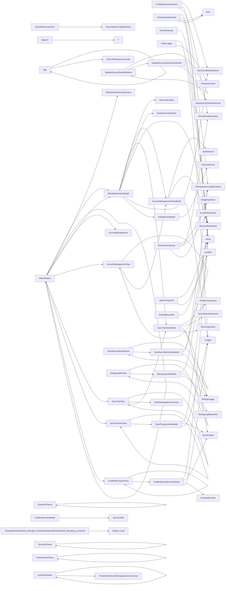

```mermaid
graph LR
    App --> App
    App --> EnumToBooleanConverter
    SyncStateCoordinator --> ISyncSessionLogRepository
    ConflictDetectionService --> ISyncConflictRepository
    ConflictDetectionService --> IFileOperationLogRepository
    ConflictDetectionService --> IDriveItemsRepository
    OneDriveFolderNode --> string
    OneDriveFolderNode --> string
    OneDriveFolderNode --> bool
    OneDriveFolderNode --> bool
    OptionT --> T
    ErrorResponse --> string
    AStarLogger --> ILogger
    AStarLogger --> ITelemetryClient
    ColourfulTheme --> ColourfulTheme
    TerminalTheme --> TerminalTheme
    ProfessionalTheme --> ProfessionalTheme
    AccountManagementViewModel --> IAuthService
    AccountManagementViewModel --> IAccountRepository
    AccountManagementViewModel --> ILogger
    UpdateAccountDetailsViewModel --> IAccountRepository
    UpdateAccountDetailsViewModel --> IAutoSyncSchedulerService
    AccountManagementView --> AccountManagementView
    AccountManagementView --> AccountManagementViewModel
    UpdateAccountDetailsWindow --> UpdateAccountDetailsWindow
    UpdateAccountDetailsWindow --> UpdateAccountDetailsViewModel
    MainWindow --> MainWindowViewModel
    MainWindow --> IWindowPreferencesService
    MainWindow --> MainWindow
    MainWindow --> AccountManagement
    MainWindow --> MainWindowViewModel
    MainWindow --> AccountManagementView
    MainWindow --> SyncTreeView
    MainWindow --> SyncProgressView
    MainWindow --> ConflictResolutionView
    MainWindowViewModel --> AccountManagementViewModel
    MainWindowViewModel --> SyncTreeViewModel
    MainWindowViewModel --> IServiceProvider
    MainWindowViewModel --> IAutoSyncCoordinator
    MainWindowViewModel --> IAccountRepository
    MainWindowViewModel --> ISyncConflictRepository
    MainWindowViewModel --> SettingsViewModel
    SyncProgressView --> SyncProgressView
    SyncProgressView --> SyncProgressViewModel
    ViewSyncHistoryWindow --> ViewSyncHistoryWindow
    ViewSyncHistoryWindow --> ViewSyncHistoryViewModel
    SyncProgressViewModel --> string
    SyncProgressViewModel --> ISyncEngine
    SyncProgressViewModel --> ILogger
    ViewSyncHistoryViewModel --> IAccountRepository
    ViewSyncHistoryViewModel --> IFileOperationLogRepository
    ViewSyncHistoryViewModel --> IDebugLogger
    SyncTreeViewModel --> IFolderTreeService
    SyncTreeViewModel --> ISyncSelectionService
    SyncTreeViewModel --> ISyncEngine
    SyncTreeViewModel --> IDebugLogger
    SyncTreeViewModel --> ISyncRepository
    SyncTreeView --> SyncTreeView
    SyncTreeView --> BooleanNegationConverter
    SyncTreeView --> SyncTreeViewModel
    DebugLogWindow --> DebugLogWindow
    DebugLogWindow --> DebugLogViewModel
    DebugLogViewModel --> IAccountRepository
    DebugLogViewModel --> IDebugLogRepository
    DebugLogViewModel --> IDebugLogger
    SettingsViewModel --> IThemeService
    SettingsWindow --> SettingsWindow
    SettingsWindow --> ThemePreferenceToDisplayNameConverter
    ConflictResolutionViewModel --> string
    ConflictResolutionViewModel --> ISyncEngine
    ConflictResolutionViewModel --> IConflictResolver
    ConflictResolutionViewModel --> ILogger
    ConflictItemViewModel --> SyncConflict
    ConflictResolutionView --> ConflictResolutionView
    ConflictResolutionView --> ConflictResolutionViewModel
    FileTransferService --> IGraphApiClient
    FileTransferService --> ILocalFileScanner
    FileTransferService --> IDriveItemsRepository
    FileTransferService --> IFileOperationLogRepository
    OptionsTypeInfo --> string
    OptionsTypeInfo --> Location
    StrongIdGeneratorTests_StrongId_GeneratesExpectedCodeOrderId_StrongId_g_received --> System_Guid
    TestAdditionalFile --> string
```
