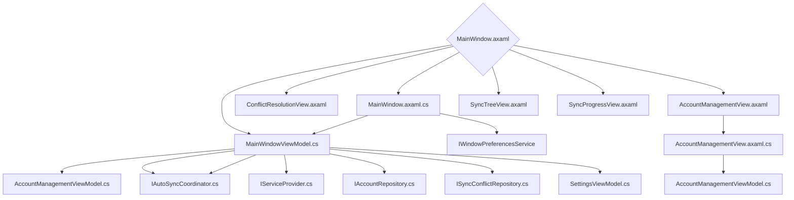

# MainWindow Class Dependencies

Source root: `src/AStar.Dev.OneDrive.Sync.Client/Home/MainWindowViewModel.cs`

This document maps dependencies from the `MainWindow`.

## Dependency Tree



## Notes

- Only types created in the `AStar.Dev.OneDrive.Sync.Client` project, it's related projects or any AStar NuGet packages that are *directly* included here will be added to this diagram. Framework or other NuGet packages are not included by design.

Want to go further?

I can extend this script to include:

```text
Namespace‑level grouping

Color‑coded nodes (Views, ViewModels, Services)

Reverse dependency lookup

Graph filtering (e.g., only show MainWindow subtree)

Clickable links to source files

Avalonia DataTemplates → ViewModel mappings

Service registration scanning (from DI container)
```

```text
Add color‑coded Mermaid nodes (Views, ViewModels, Services)

Add namespace grouping (Mermaid subgraphs)

Add reverse dependency lookup (e.g., "what depends on MainWindow?")

Add filtering so you can generate a graph starting only from MainWindow
```

But first — get the script running.
