# MainWindow Class Dependencies (3 Levels) - Mermaid Flowchart

Source root: `src/AStar.Dev.OneDrive.Sync.Client/MainWindow/MainWindow.axaml.cs`

```mermaid
graph TD
    MW["MainWindow<br/>src/.../MainWindow/MainWindow.axaml.cs"]

    %% Level 1
    MWM["MainWindowViewModel<br/>src/.../MainWindow/MainWindowViewModel.cs"]
    IWPS["IWindowPreferencesService<br/>src/.../Infrastructure/Services/IWindowPreferencesService.cs"]
    WP["WindowPreferences<br/>src/.../Core/Models/WindowPreferences.cs"]
    APPHOST["App.Host<br/>src/.../App.axaml.cs"]

    MW --> MWM
    MW --> IWPS
    MW --> WP
    MW --> APPHOST

    %% Level 2
    AMVM["AccountManagementViewModel<br/>src/.../Accounts/AccountManagementViewModel.cs"]
    STVM["SyncTreeViewModel<br/>src/.../Syncronisation/SyncTreeViewModel.cs"]
    ISP["IServiceProvider<br/>.NET DI runtime"]
    IASC["IAutoSyncCoordinator<br/>src/.../Infrastructure/Services/IAutoSyncCoordinator.cs"]
    IAR["IAccountRepository<br/>src/.../Infrastructure/Repositories/IAccountRepository.cs"]
    ISCR["ISyncConflictRepository<br/>src/.../Infrastructure/Repositories/ISyncConflictRepository.cs"]

    WPS["WindowPreferencesService<br/>src/.../Infrastructure/Services/WindowPreferencesService.cs"]
    SDC["SyncDbContext<br/>src/.../Infrastructure/Data/SyncDbContext.cs"]
    WPE["WindowPreferencesEntity<br/>src/.../Core/Data/Entities/WindowPreferencesEntity.cs"]
    TP["ThemePreference<br/>src/.../Core/Models/Enums/ThemePreference.cs"]

    AHB["AppHost.BuildHost()<br/>src/.../AppHost.cs"]

    MWM --> AMVM
    MWM --> STVM
    MWM --> ISP
    MWM --> IASC
    MWM --> IAR
    MWM --> ISCR

    IWPS --> WPS
    WPS --> SDC
    WPS --> WPE
    WPS --> TP

    APPHOST --> AHB

    %% Level 3
    IAS["IAuthService<br/>src/.../Infrastructure/Services/Authentication/IAuthService.cs"]
    ILAMVM["ILogger<AccountManagementViewModel><br/>Microsoft.Extensions.Logging"]

    IFTS["IFolderTreeService<br/>src/.../Infrastructure/Services/OneDriveServices/IFolderTreeService.cs"]
    ISSS["ISyncSelectionService<br/>src/.../Infrastructure/Services/ISyncSelectionService.cs"]
    ISE["ISyncEngine<br/>src/.../Infrastructure/Services/ISyncEngine.cs"]
    IDL["IDebugLogger<br/>src/.../Infrastructure/Services/IDebugLogger.cs"]
    ISR["ISyncRepository<br/>src/.../Infrastructure/Repositories/ISyncRepository.cs"]

    EFCORE["DbContext / DbSet<T> APIs<br/>Microsoft.EntityFrameworkCore"]

    SRP["Service registration pipeline<br/>AddDatabaseServices/AddAuthenticationServices/...<br/>src/.../AppHost.cs"]

    AMVM --> IAS
    AMVM --> IAR
    AMVM --> ILAMVM

    STVM --> IFTS
    STVM --> ISSS
    STVM --> ISE
    STVM --> IDL
    STVM --> ISR

    SDC --> EFCORE
    AHB --> SRP
```

## Notes

- This diagram preserves the same scope as `docs/mainwindow-first-3-levels-v1.md` and is limited to the first 3 levels.
- Framework UI types used directly in `MainWindow` (for example `Window`, `DispatcherTimer`, `PixelPoint`) are intentionally not expanded.
